# Wx-pub-agent

[](https://app.codecov.io/gh/hololee2cn/wx-pub-agent/)
[][hub]

中文 | [English](https://github.com/hololee2cn/wxpub/blob/master/doc/README_EN.md)

[hub]: https://hub.docker.com/repository/docker/leeoj2/pubplatform

## 介绍
>一个微信公众平台后端服务，目前主要定位是代理推送消息。

- **支持群发模板消息推送**；
- **支持关键词文本回复**；
- **支持用户消息推送状态查询**；
- **支持用户信息本地化存储**；

## 架构预览


## 安装
这里提供几种方式安装。

### 镜像

Docker镜像部属已经支持在[Docker Hub](https://hub.docker.com/r/leeoj2/pubplatform)

你可以通过docker-compose方式进行[部属](./docker/docker-compose.yaml)

```bash
docker-compose up -d
```
wxpub-agent服务在部属主机现在能被访问在<http://localhost:80/>

### 构建和运行源代码

构建服务源代码需要以下环境:

* Go [version 1.17](https://golang.org/doc/install).

```bash
go build ./src/main.go
./main webapi
./main captcha
```

>注：[服务环境变量](./src/webapi/config/dev_configs.toml)默认为开发环境，若需要切换环境，需自行配置，[MYSQL表自建脚本](./docker/initsql)需自行运行创建

## 联系与反馈
- 我们推荐您优先使用[github issue](https://github.com/hololee2cn/wxpub/issues)作为首选问题反馈和需求提交的通道；

## 参与
我们欢迎您以各种方式参与到开源项目中来，参与方式包括不限于：
- 反馈使用中遇到的问题和Bug => [github issue](https://github.com/hololee2cn/wxpub/issues)
- 提交代码，让服务更快、更稳、更好用 =>[github PR](https://github.com/hololee2cn/wxpub/pulls)

## TODO
- [ ] 支持可插拔的sms服务和captcha服务
- [ ] 自定义菜单创建和事件响应(选)
- [ ] sms服务和captcha服务一键脚本部署

## License
[MIT](https://github.com/hololee2cn/wxpub/blob/master/LICENSE)